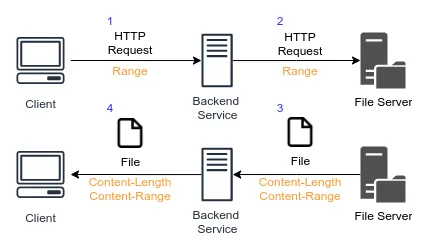
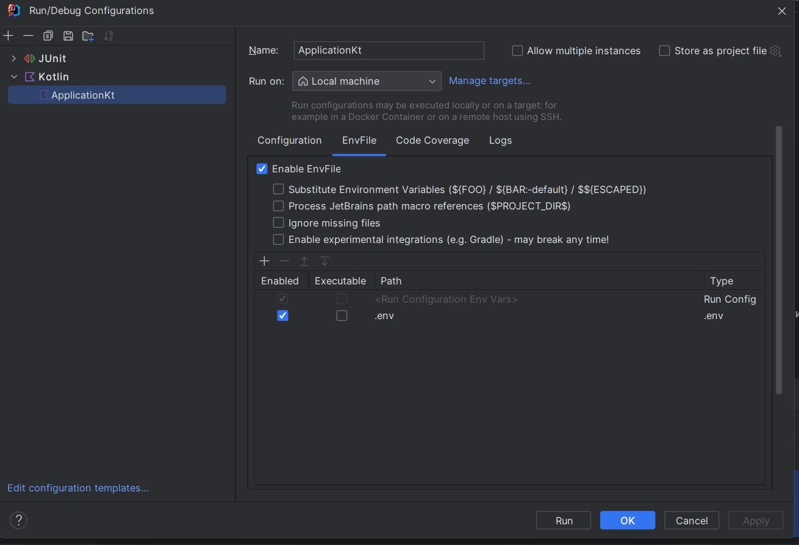

## MinioTube

### ОБЩЕЕ ОПИСАНИЕ ТЕСТОВОГО ЗАДАНИЯ
#### Фреймворки и библиотеки
Язык - Kotlin\
#### Создать серверное приложение используя:
Ktor https://ktor.io/docs/intellij-idea.html и
Exposed https://ktor.io/docs/interactive-website-add-persistence.html \
P.S.\
Бд – h2 (если потребуется при реализации ТЗ)\
Структурировать – контроллеры, сервисы, репозитории (можно dto и mappers)\
Удобнее работать будет в Intellij Idea Ultimate
ТЗ
Развернуть локально в Docker minio s3 хранилище.
1. Приложение должно принять с html формы клиента большой видео файл (1гб)
2. Загрузить его в объектное хранилище minio (контроллер на аплоад)
3. На отдельном контроллере организовать стрим его по запросу с фронтенда
   Сделать контроллер с html страницей, на которой разместить js код любого видео плеера
   (например https://videojs.com/getting-started/) и просматривать строим с ранее созданного
   контроллера стрима.

### Архитектура стримминга


### Запуск 
Перед запуском нужно прописать переменные окружения в .env фале\
Так же использовать этот файл в конфигурации запуска

#### S3 minio
```shell
docker-copose up
```
### Использование 
#### Upload Page 
http://localhost:8080/upload

#### Available Streams Endpoint
http://localhost:8080/streams

#### Watch Page
http://localhost:8080/watch/{videoId}

#### Minio Admin Page
http://localhost:9001